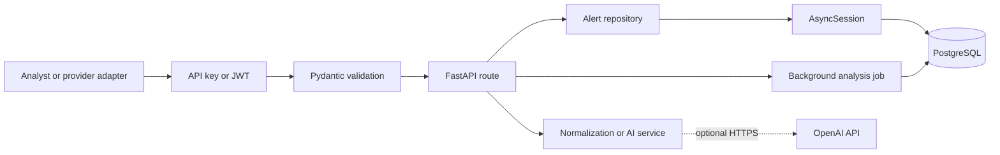

# Cloud Security Incident Response API

A production-oriented FastAPI service that ingests cloud-security findings,
normalizes provider data, tracks investigation state, and optionally generates
AI-assisted triage guidance.

The project demonstrates async API design, typed validation, PostgreSQL
persistence, migrations, dependency injection, external-service resilience,
security controls, automated tests, Docker, and CI.

## What is implemented

- Normalized alert creation plus AWS GuardDuty and Wazuh ingestion
- Async PostgreSQL access with SQLAlchemy 2.0 and `asyncpg`
- Duplicate-provider-event protection using a database uniqueness constraint
- Alert retrieval, filtering, bounded pagination, and status updates
- Incidents that group alerts into a small open/contained/closed workflow
- Database users, JWT login, analyst/admin roles, and append-only audit events
- Optional background OpenAI triage with pollable job status
- Machine API-key authentication for provider ingestion
- Request IDs, rate limiting, Prometheus metrics, liveness, and readiness
- Alembic migrations, isolated API tests, Docker Compose, and GitHub Actions CI

AI triage is optional. All ingestion, persistence, filtering, and incident
workflow features work without an OpenAI key.

## Architecture



The code separates HTTP concerns, validation contracts, business integrations,
and persistence:

```text
app/
├── api/routes/       # HTTP endpoints and status-code translation
├── core/             # Typed configuration and authentication
├── db/models/        # SQLAlchemy database models
├── repositories/     # Reusable database operations
├── schemas/          # Pydantic request and response contracts
├── services/         # GuardDuty normalization and OpenAI adapter
└── main.py           # Application lifecycle and middleware
```

See [Architecture and decisions](docs/architecture.md) for the request flow,
data model, security boundaries, and design tradeoffs.

## Run with Docker

Requirements: Docker with Compose support.

```bash
cp .env.example .env
docker compose up --build
```

The API starts at <http://127.0.0.1:8000>. Useful pages:

- Swagger UI: <http://127.0.0.1:8000/docs>
- Liveness: <http://127.0.0.1:8000/health>
- Database readiness: <http://127.0.0.1:8000/ready>

The Compose configuration applies pending migrations before starting the API.
The default local API key is `local-development-api-key`. Replace it through
`CIR_API_KEY` before using any shared environment.

## Run locally

Requirements: Python 3.12+, [uv](https://docs.astral.sh/uv/), and Docker.

```bash
uv sync
docker compose up -d postgres
uv run alembic upgrade head
uv run uvicorn app.main:app --reload
```

Configuration uses environment variables prefixed with `CIR_`. Copy
`.env.example` to `.env` to customize local values; `.env` is ignored by Git.

Important settings:

- `CIR_DATABASE_URL` — async SQLAlchemy PostgreSQL URL
- `CIR_API_KEY` — machine credential for provider ingestion and first bootstrap
- `CIR_JWT_SECRET` — at least 32 random bytes used to sign user tokens
- `CIR_ACCESS_TOKEN_MINUTES` — user-token lifetime
- `CIR_RATE_LIMIT_REQUESTS` and `CIR_RATE_LIMIT_WINDOW_SECONDS` — local limiter
- `CIR_OPENAI_API_KEY` — optional; enables successful AI analysis jobs

## Use the API

Provider integrations use `X-API-Key`. The same credential bootstraps the
first administrator exactly once:

```bash
curl -X POST http://127.0.0.1:8000/api/v1/auth/bootstrap \
  -H "Content-Type: application/json" \
  -H "X-API-Key: local-development-api-key" \
  -d '{
    "username": "admin",
    "password": "change-this-demo-password",
    "role": "admin"
  }'
```

Log in through `POST /api/v1/auth/login`, then send the returned token as
`Authorization: Bearer TOKEN` for analyst and administrator actions. In
Swagger UI, **Authorize** supports both machine API keys and bearer tokens.

Create a normalized alert with the machine key:

```bash
curl -X POST http://127.0.0.1:8000/api/v1/alerts \
  -H "Content-Type: application/json" \
  -H "X-API-Key: local-development-api-key" \
  -d '{
    "source": "guardduty",
    "external_id": "finding-001",
    "title": "Suspicious API activity",
    "description": "An unusual API call was detected.",
    "severity": 8.5,
    "occurred_at": "2026-08-08T19:00:00Z",
    "account_id": "123456789012",
    "region": "us-west-2",
    "resource": "arn:aws:iam::123456789012:user/example"
  }'
```

To exercise provider normalization with the included sample:

```bash
curl -X POST http://127.0.0.1:8000/api/v1/alerts/ingest/guardduty \
  -H "Content-Type: application/json" \
  -H "X-API-Key: local-development-api-key" \
  --data @examples/guardduty-finding.json
```

### Endpoints

- `POST /api/v1/alerts` — create a normalized alert
- `POST /api/v1/alerts/ingest/guardduty` — normalize a GuardDuty finding
- `POST /api/v1/alerts/ingest/wazuh` — normalize a Wazuh alert
- `POST /api/v1/alerts/validate` — validate without persistence
- `GET /api/v1/alerts` — filter and paginate alerts
- `GET /api/v1/alerts/{alert_id}` — retrieve one alert
- `PATCH /api/v1/alerts/{alert_id}/status` — update investigation state
- `POST /api/v1/alerts/{alert_id}/analyze` — queue optional AI triage
- `GET /api/v1/alerts/analysis-jobs/{job_id}` — poll AI job state
- `POST /api/v1/incidents` — group alerts into an incident
- `GET /api/v1/incidents` — list incidents
- `PATCH /api/v1/incidents/{incident_id}/status` — update an incident
- `POST /api/v1/auth/login` — obtain an analyst bearer token
- `POST /api/v1/auth/users` — create users as an administrator
- `GET /api/v1/audit-events` — review audit records as an administrator
- `GET /health` — process liveness
- `GET /ready` — database connectivity
- `GET /metrics/` — Prometheus metrics

List filters include `source`, `status`, `minimum_severity`, `limit`, and
`offset`. `limit` is capped at 100 to bound query and response size.

## Optional AI triage

Set `CIR_OPENAI_API_KEY` and optionally `CIR_OPENAI_MODEL`. The analyzer sends
only normalized alert context—not application credentials—to the configured
OpenAI-compatible chat-completions endpoint.

The integration:

- uses an explicit request timeout;
- retries transport errors, rate limits, and server errors up to three times;
- requests JSON and validates required output fields;
- treats alert text as untrusted data in the system instruction; and
- stores the summary, recommended action, and analysis timestamp.

`POST .../analyze` returns `202 Accepted` with a job ID. FastAPI runs the
small job after responding, and clients poll its status endpoint. This keeps
the learning implementation simple; a multi-replica production deployment
should replace it with SQS, Celery, or another durable queue.

AI output is advisory. It should support, not replace, analyst judgment.

## Test and quality checks

```bash
uv run ruff format --check .
uv run ruff check .
uv run pytest -q
```

API tests replace the production database dependency with a fresh in-memory
SQLite database. CI additionally starts PostgreSQL and applies every Alembic
migration, catching migration failures separately from endpoint behavior.

## Security choices

- Secrets come from environment-backed settings and `.env` is not committed.
- API keys are compared with `secrets.compare_digest`.
- User passwords use Argon2 hashes and signed JWTs expire after a configured
  interval.
- Analyst and administrator roles protect workflow and user-management routes.
- Security-relevant changes append audit events with actor and resource IDs.
- Unknown request fields are rejected for normalized alert ingestion.
- Provider duplicates are enforced by PostgreSQL, not by a race-prone
  read-before-write check.
- Severity and workflow states are constrained at both API and database layers.
- User-supplied request IDs are accepted only when they are valid UUIDs.
- Error responses do not expose database or provider response bodies.
- A fixed-window limiter bounds traffic in this single-instance demo.

The included local authentication is intentionally educational. A public
product should replace local passwords with an identity provider, move rate
limits and background jobs to shared infrastructure, and store secrets in a
managed secret store.

## Current scope

This repository is a complete, runnable MVP rather than a full SIEM. It
processes individual findings, groups alerts into incidents, and demonstrates
the main security and operational boundaries without unnecessary platform
complexity. Future enterprise extensions could include signed EventBridge/SNS
batch ingestion, an external identity provider, durable queue workers,
distributed rate limiting, multi-tenant isolation, and account-specific
Terraform. See the [AWS deployment blueprint](deploy/aws/README.md).

## License

No license has been selected. Add one before distributing or accepting
external contributions.
